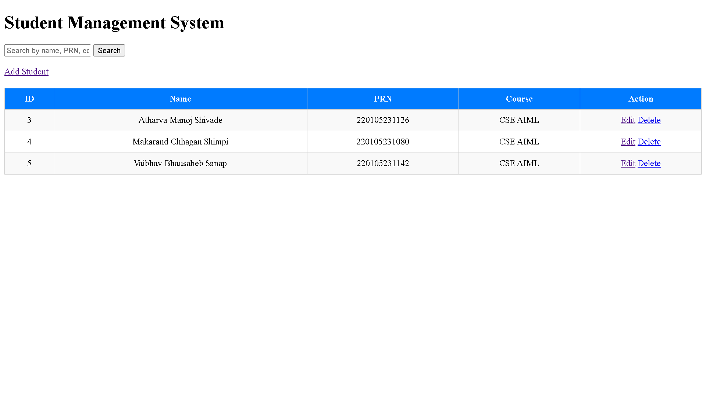
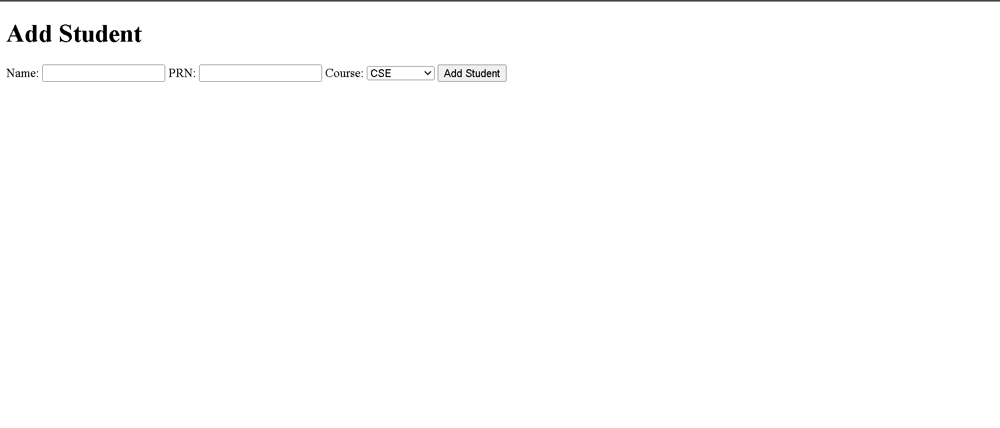
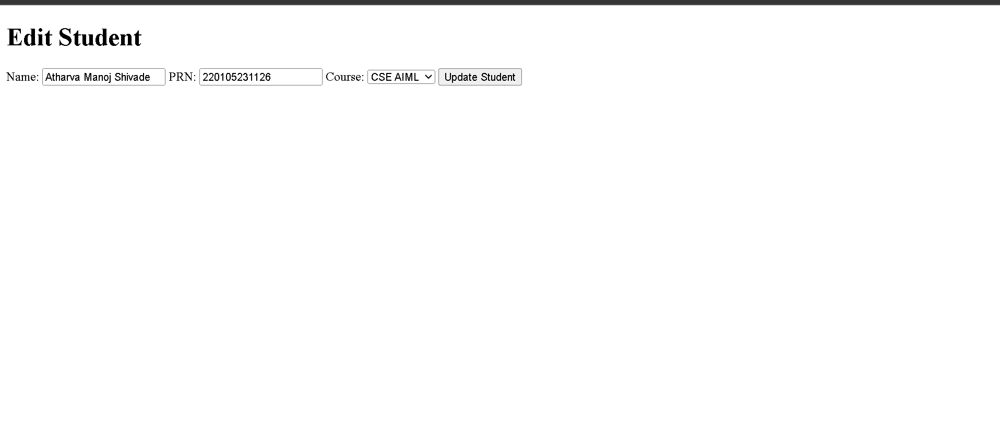

# Student Management System

A full-stack web application to manage student records efficiently with a clean and structured interface.

---

##  Features

- Add, Edit, Delete students (CRUD operations)
- Search students by Name, PRN, or Course
- 12-digit PRN validation
- Course selection dropdown
- Table-based structured UI with clean design
- Responsive and user-friendly interface

---

##  Tech Stack

- Backend: Python (Flask)
- Frontend: HTML, CSS
- Database: SQLite

---

## Screenshots

### Main Dashboard


### Add Student Page


### Edit Student Page


---

## How to Run Locally

1. Clone the repository:
   ```
   git clone https://github.com/AtharvaS30/student-management-system
   ```

2. Navigate to the project folder:
   ```
   cd "Student management system"
   ```

3. Install dependencies:
   ```
   pip install flask
   ```

4. Run the application:
   ```
   python app.py
   ```

5. Open in browser:
   ```
   http://127.0.0.1:5000
   ```

---

## Project Purpose

This project demonstrates full-stack development skills including backend logic, database integration, frontend design, and user interaction.

---

## Author

Atharva Shivade
